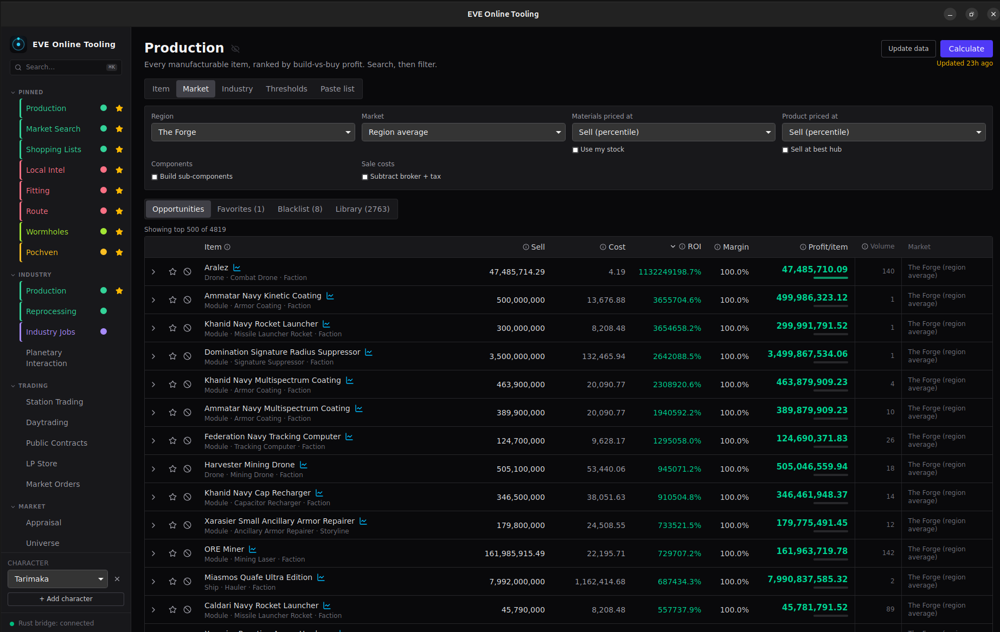

# EVE Online Tooling

A **free, open-source** desktop app (Linux · macOS · Windows) for
[EVE Online](https://www.eveonline.com/) — a bundle of industry, market,
character and intel tools over one shared data layer. Built with **Tauri 2**
(Rust) + **React / TypeScript**; data from EVE's public **ESI** API and the
**SDE** (static data export).

## What it is

- **One app, many modules.** Log in one or more characters via EVE SSO (tokens
  live in your **OS keychain**), or use the public market/industry tools with no
  login at all. Switch modules from a grouped sidebar or the ⌘K / Ctrl+K palette.
- **Local & private.** Everything runs on your machine; ESI and SDE data is
  cached locally. No account, no server, no telemetry.
- **Free & open source** under the **MIT** license.

## What it provides

**Industry**
- **Production** — rank *every* manufacturable item by build-vs-buy **profit**
  at a chosen market, with recursive build-vs-buy, T2 invention and T3 relics,
  ME/fees, owned-blueprint awareness, and a per-material drill-down.
- **Reprocessing** — rank ores by reprocess-vs-sell at your refining efficiency.
- **Industry Jobs** — personal + corp jobs ("what's cooking") with finish timers
  and slot usage.
- **Planetary Interaction** — colonies at a glance: extraction, restart timers,
  storage and per-commodity balance.

**Trading & market**
- **Station Trading** — scan a hub for buy→sell flips after fees, with depth and
  daily volume.
- **Daytrading** — best cross-region flip per item, ranked by ISK/m³.
- **Market Orders** — your open orders with **undercut detection**, a one-tick
  re-list helper, and an opt-in **build-cost guard** (flags sell orders whose
  undercut price would drop below build cost, priced at the order's own station).
- **Market Search** · **Appraisal** · **Public Contracts** · **LP Store** —
  find sell orders + price/volume history, value pasted items, find under-priced
  contracts, rank loyalty offers by ISK/LP.

**Character**
- **Assets** · **Character** (skills/standings/research/mining/fleet) ·
  **Accounting** (wallet + FIFO profit) · **Transactions** · **Notifications**.
- **Fitting** — a PYFA-grade fit editor + dogma engine (DPS, weapon ranges, EHP,
  cap sim, speed/align, targeting) at all-V or real skills; EFT + ESI import/export.
- **Shopping Lists** — named buy lists fed from across the app, with Multibuy
  export and EVE chat-channel capture.

**Combat / Intel**
- **PVP** — paste pilot names → kills/losses & ISK efficiency, most-flown hulls,
  and the fits they fly (reconstructed from killmails, analysed for scram range,
  weapon ranges, DPS and EHP) via zKillboard + the fitting engine.
- **Local Intel** — paste the in-game Local list → blue/neutral/red by standing,
  corp and alliance, with a watchlist and zKillboard danger enrichment.
- **DPS Meter** — live combat readout from your gamelog (damage/reps/cap/mining),
  EULA-safe.
- **Route** · **Wormholes** · **Pochven** · **Universe** · **Incursions** ·
  **Faction Warfare** · **Exploration** — travel/kills maps, wormhole chain
  mapping + jump planner, Triglavian entry planning, and reference data.

**Extend it**
- **Scripts** — small **Rhai**/**JavaScript** snippets, run once or on a timer,
  with a curated trusted API and resource limits. See [`docs/scripts.md`](docs/scripts.md).
- **Plugins** — sandboxed third-party **WASM** logic and iframe UI pages, gated
  by explicit capabilities. See [`docs/plugins.md`](docs/plugins.md).
- **MCP** — expose read-only tools to an AI client over a local MCP bridge. See
  [`docs/mcp.md`](docs/mcp.md).

## Install

Grab the installer for your OS from the
[latest release](https://github.com/th-lange/eve-online-tooling/releases/latest):

- **Linux** — `.AppImage` (`chmod +x` it, then run), `.deb`, or `.rpm`.
- **macOS** — open the `.dmg` and drag the app to Applications.
- **Windows** — run the `.msi` (or the NSIS `-setup.exe`).

The first time you open the Production module it downloads the EVE **SDE** (a few
hundred MB) into your app data dir — a one-off.

### The builds are unsigned (on purpose)

This is a free hobby project, so the installers aren't code-signed — your OS will
warn on first launch. That's expected and safe to bypass:

- **macOS** — right-click the app → **Open** (or
  `xattr -dr com.apple.quarantine "/Applications/EVE Online Tooling.app"`).
- **Windows** — SmartScreen: **More info → Run anyway**.
- **Linux** — no prompt.

Signing a Windows Public-Trust cert (the only kind that suppresses SmartScreen)
requires identity validation available only to developers in the US/CA/EU/UK, and
Apple's Developer ID is a recurring fee — neither is worth it to dodge a dialog on
a free tool. The full reasoning is in [`SIGNING.md`](SIGNING.md); it's a
deliberate, closed decision, not a TODO.

## Build from source & contribute

Prerequisites, dev commands, architecture notes and the release process live in
[`docs/development.md`](docs/development.md). Work is tracked as
[GitHub issues](https://github.com/th-lange/eve-online-tooling/issues).
